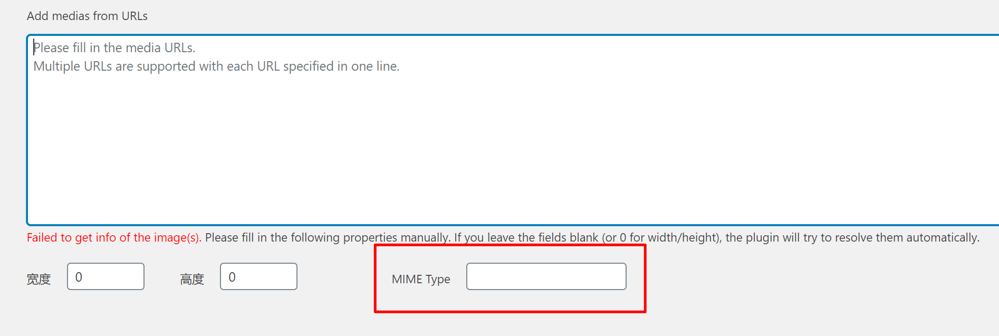
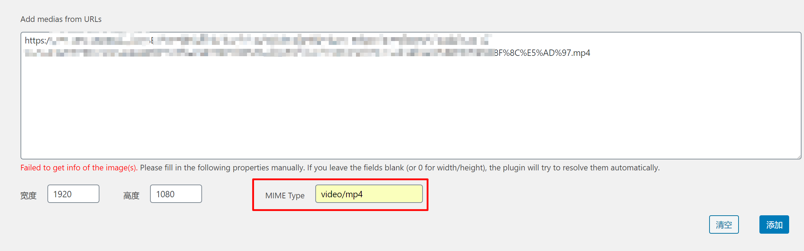
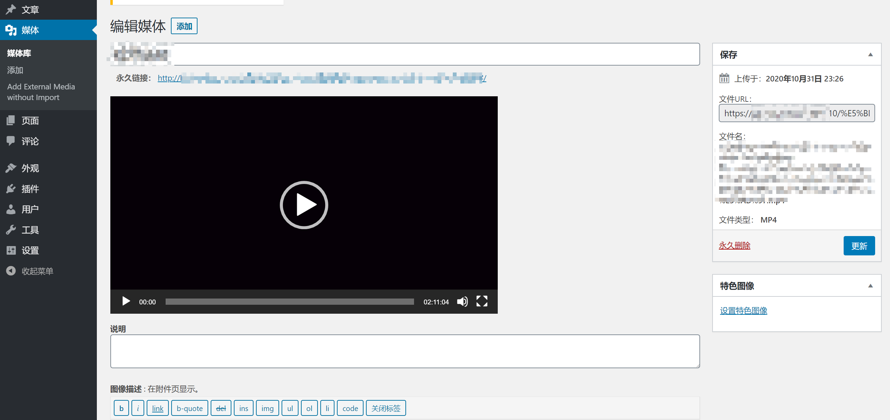

# external-media-without-import-1.1.3
在大佬的插件基础下,做了小改动使该wordpress插件支持插入多个外链类型(如视频,图像等)

(原先插件介绍可见readme_old文件,或移步至https://github.com/zzxiang/external-media-without-import)

改动如下: 在下图的 MIME Type 处(先随便输入无效地址后会弹出),填入对应文件类型后再提交,前面的大小信息随便填个大于0的数就好,这样就能正确识别文件了

例如mp4视频填入: video/mp4

例如jpg图片填入: image/jpeg

安装只要替换掉原zip 1.1.2版本包中php文件,之后卸载原版插件,上传安装这个版本即可

